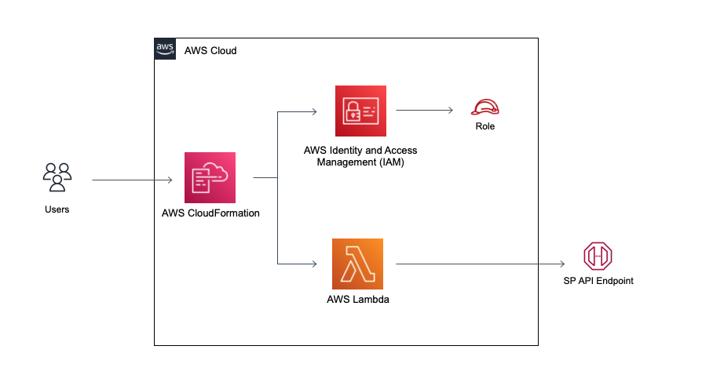

:xrefstyle: short

Deploying this Quick Start with
default parameters builds the following SP API tutorial environment in the
AWS Cloud.

// Replace this example diagram with your own. Follow our wiki guidelines: https://w.amazon.com/bin/view/AWS_Quick_Starts/Process_for_PSAs/#HPrepareyourarchitecturediagram. Upload your source PowerPoint file to the GitHub {deployment name}/docs/images/ directory in this repo. 

[#architecture1]
.Quick Start architecture for SP API tutorial on AWS

As shown in <<architecture1>>, the Quick Start sets up the following:

* A secure IAM Role with permissions to call SP API endpoints.

* A Lambda function which assumes IAM Role to call SP API endpoints.

